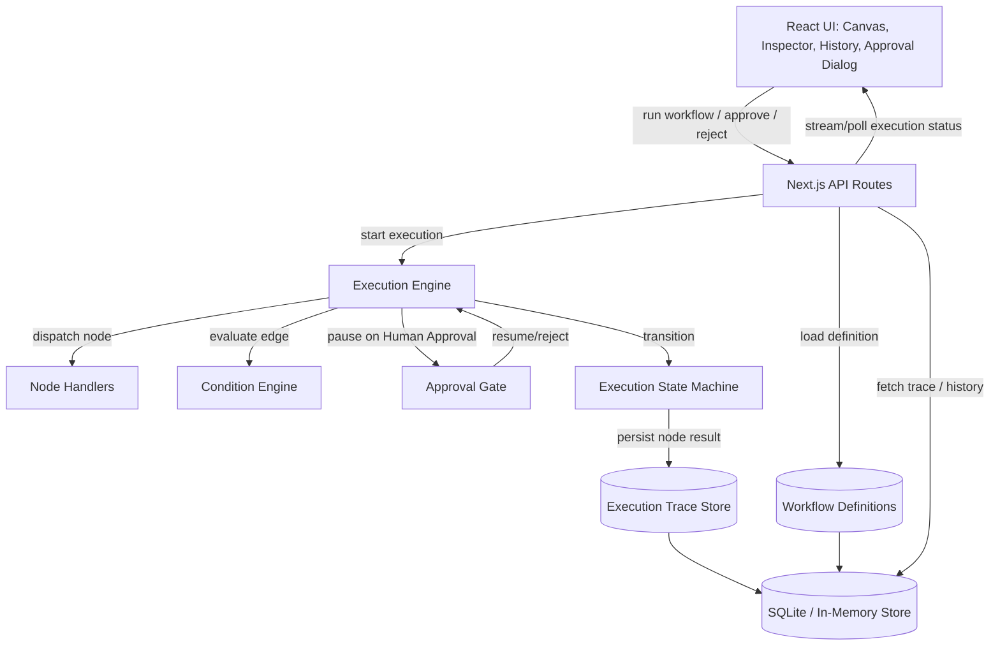

# Relay — Technical Architecture

**Status:** FUNCTIONAL DEMO / PROTOTYPE

---

## 1. Architecture Overview

Relay is a single Next.js application (frontend + API routes) with an in-process workflow execution engine. There is no distributed infrastructure. Workflow definitions and execution history are persisted to SQLite (or in-memory as a fallback for zero-setup demos). The engine interprets workflow data at runtime; UI components render whatever state the engine produces — they never encode workflow logic themselves.

Design priorities, in order: (1) execution correctness and visibility, (2) trace fidelity, (3) safety of the condition/expression model, (4) simplicity of deployment. Everything else is secondary.

## 2. Architecture Diagram



## 3. Frontend

- **Framework:** Next.js (App Router) + React + TypeScript + Tailwind.
- **State:** Local component state plus a lightweight execution-status poller (or SSE if implemented) that reads execution state from the API during a run. No global state library required for MVP.
- **Rendering separation:** The canvas renders `Node`/`Edge` objects generically by `type`; a small style/icon map keys off `node.type`. Adding a node type never requires new canvas code beyond registering its visual metadata.
- **Screens:** Workflow Canvas, Execution Inspector (panel), Execution History (panel/list), Scenario Selector, Human Approval Dialog (modal). Full behavior in FRONTEND_SPEC.md.

## 4. Backend

- **API routes** (Next.js route handlers) expose:
  - `GET /api/workflows/:id` — fetch a workflow definition.
  - `POST /api/workflows/:id/executions` — start an execution (optionally with a scenario payload).
  - `GET /api/executions/:id` — fetch current execution state + node executions (polled during a run).
  - `POST /api/executions/:id/approve` — resolve a pending Human Approval node (approve/reject).
  - `GET /api/executions` — list execution history.
- API routes are the only place that touches persistence. The engine is invoked server-side; the client never executes workflow logic.

## 5. Workflow Definition Model

```ts
type Workflow = {
  id: string;
  name: string;
  description: string;
  nodes: WorkflowNode[];
  edges: WorkflowEdge[];
  status: "draft" | "active" | "archived";
  createdAt: string;
  updatedAt: string;
};
```

## 6. Node Model

```ts
type WorkflowNode = {
  id: string;
  type:
    | "trigger.manual" | "trigger.webhook_sim" | "trigger.schedule_sim"
    | "transform.classify" | "transform.extract" | "transform.enrich"
    | "transform.score" | "transform.generate_text"
    | "logic.condition" | "logic.switch"
    | "action.send_email_demo" | "action.create_task_demo"
    | "action.update_record_demo" | "action.notification_demo"
    | "human.approval";
  name: string;
  configuration: Record<string, unknown>;
  position: { x: number; y: number };
};
```

`configuration` is node-type-specific (e.g., a `logic.condition` node's configuration holds its `ConditionExpression`; an `action.send_email_demo` node's configuration holds a template string). All configuration is validated against a per-type schema at load time (see SECURITY_AND_ACCESS.md).

## 7. Edge Model

```ts
type WorkflowEdge = {
  id: string;
  source: string;      // node id
  target: string;      // node id
  condition?: ConditionExpression | "approved" | "rejected" | "default";
};
```

For `logic.condition` and `logic.switch` nodes, outgoing edges are disambiguated by a `condition` label the engine evaluates against the node's output. For `human.approval` nodes, outgoing edges are labeled `"approved"` / `"rejected"`. All other nodes use a single `"default"` edge.

## 8. Execution Engine

The engine is a small synchronous/async interpreter:

1. Load the `Workflow` and locate its trigger node(s).
2. Create an `Execution` record (`status: RUNNING`, `currentNode` set to the trigger).
3. Walk nodes in topological order following taken edges, maintaining an execution **context** object (a merged bag of all node outputs so far, keyed by node id and by well-known field names like `leadScore`).
4. For each node: create a `NodeExecution` (`status: RUNNING`), invoke the node's handler with `(config, context)`, capture `{ output, durationMs }` or `{ error }`, set `status: SUCCESS | FAILED | SKIPPED`, persist, and advance `currentNode`.
5. On a `logic.condition`/`logic.switch` node, evaluate outgoing edges via the Condition Engine and select exactly one path; unmatched branches are marked `SKIPPED` in the trace for transparency.
6. On a `human.approval` node, set `Execution.status = WAITING_FOR_APPROVAL`, set the `NodeExecution.status = WAITING`, and suspend. The engine resumes only via the `/approve` API call, which re-enters the same execution at the point of suspension.
7. On any handler error, mark the node `FAILED`; if the node's configuration allows retry (used for Scenario D), the engine performs one deterministic retry after a short simulated delay; if it succeeds, continue as `SUCCESS` (with `retried: true` noted); otherwise the `Execution.status = FAILED`.
8. On reaching a terminal node with no further edges, set `Execution.status = COMPLETED` and `completedAt`.

The engine is intentionally single-threaded and in-process — no external workers or queues. This is correct for a demo's execution volume and keeps the trace trivially consistent.

## 9. Node Handlers

Each node type maps to a small, pure(ish) handler function with a shared interface:

```ts
type NodeHandler = (config: unknown, context: ExecutionContext) => Promise<{
  output: Record<string, unknown>;
}>;
```

Handlers for the "intelligence" nodes are implemented behind interfaces so deterministic and (future) LLM-backed implementations are interchangeable:

- `Classifier` → `DeterministicClassifier` (rule-based keyword/field matching on the inquiry message).
- `Enricher` → `DemoEnricher` (looks up a small synthetic company dataset keyed by domain/company name; falls back to deterministic heuristics like company-name length for unknown companies).
- `Scorer` → `DeterministicScorer` (weighted formula over company size, industry match, source, message signal).
- `TextGenerator` → `DeterministicTextGenerator` (template-based draft response, not an LLM call).

Action handlers (`action.*`) never perform real network side effects. They construct a "would have sent / would have created" payload, mark it clearly as simulated in their output, and return immediately.

## 10. Condition Engine

Conditions are structured data, evaluated by a small allow-listed interpreter — never `eval` or `new Function`.

```ts
type ConditionExpression = {
  field: string;                 // dot-path into execution context, e.g. "score.leadScore"
  operator:
    | "equals" | "not_equals"
    | "greater_than" | "greater_than_or_equal"
    | "less_than" | "less_than_or_equal"
    | "contains" | "in";
  value: string | number | boolean | (string | number)[];
};
```

The evaluator resolves `field` via a strict dot-path lookup against a plain object (no prototype chain traversal, no bracket-notation injection), applies the named operator via a fixed switch statement, and returns a boolean plus a human-readable explanation string (`"leadScore (87) greater_than 80 → true"`) that is stored in the trace so the UI can show *why* a branch was taken.

## 11. Human Approval Mechanism

Modeled as a first-class suspend/resume point in the state machine, not a UI-only pause:

- The engine persists `Execution.status = WAITING_FOR_APPROVAL` and the pending node id **server-side** before returning control to the client. This is the authoritative state; the client cannot fabricate an "approved" execution.
- `POST /api/executions/:id/approve` validates that the execution is actually in `WAITING_FOR_APPROVAL` for the given node, records the decision (`approved: boolean`, `decidedAt`, optional `note`), and re-invokes the engine to continue down the corresponding edge.
- Rejection follows a `"rejected"` edge if the workflow defines one; if not, the engine transitions the execution to a safe terminal `REJECTED` status rather than silently continuing.

## 12. Execution State Machine

**Execution-level states:** `PENDING → RUNNING → (WAITING_FOR_APPROVAL ⇄ RUNNING) → COMPLETED | FAILED | REJECTED`

**Node-level states:** `PENDING → RUNNING → SUCCESS | FAILED | SKIPPED | WAITING`

`FAILED` at the node level may transition to `RUNNING` once more via the deterministic retry path before finally resolving to `SUCCESS` (recovered) or `FAILED` (terminal), which is how Scenario D is expressed without a general-purpose retry subsystem.

## 13. Execution History

A flat, queryable list of `Execution` summaries (`id, workflowId, status, startedAt, completedAt, durationMs`). MVP does not require pagination UI beyond a simple scroll/list, since the demo data set is small and bounded (a handful of seeded executions plus whatever the user runs live).

## 14. Persistence

- **Default:** SQLite file (e.g., via `better-sqlite3` or `drizzle`/`prisma` with a SQLite adapter) so history survives a page refresh and server restart, which materially improves the demo's credibility.
- **Fallback:** in-memory store behind the same repository interface, so the app can run with zero setup (no file writes required) if desired for a constrained hosting environment. This is a swappable implementation of one `ExecutionRepository` / `WorkflowRepository` interface — not two parallel code paths in the engine.
- No ORM complexity beyond what's needed for four small tables: `workflows`, `nodes` (or JSON column on workflow), `executions`, `node_executions`.

## 15. Demo Adapters

All `action.*` handlers are "Demo Adapters." Each returns a structured, clearly-labeled payload, e.g.:

```json
{
  "adapter": "Simulated Email",
  "wouldSendTo": "sarah@acme.example",
  "subject": "Following up on your enterprise inquiry",
  "note": "No real email was sent. This is a demo adapter."
}
```

The UI surfaces the `adapter` and `note` fields prominently wherever action output is displayed.

## 16. Deterministic Data

Scenario A–D each map to a fixed input payload and fixed handler behavior (including a hardcoded failure point for Scenario D's first attempt) so results are reproducible for every demo run, not dependent on randomness. Any "randomness" in enrichment/scoring is seeded/derived from the input data itself (e.g., a hash of company name), not `Math.random()`, so re-running the same scenario always produces the same trace.

## 17. Testing

- **Unit tests:** condition evaluator (all operators, malformed field paths, missing fields), each node handler in isolation, state machine transitions (including retry and approval branches).
- **Integration tests:** full engine run for each of Scenario A–D asserting the exact sequence of node statuses and the final execution status.
- **API tests:** approve/reject endpoints reject calls when the execution is not actually `WAITING_FOR_APPROVAL`; workflow/node configuration validation rejects malformed input (see SECURITY_AND_ACCESS.md).
- **UI smoke tests:** RUN WORKFLOW drives visible state changes; clicking a node opens the inspector with matching data.

## 18. Deployment

Single Next.js app deployable to any standard Node hosting target (e.g., Vercel, a small VM, or a container) with a local SQLite file or in-memory store — no environment variables or secrets required to run the demo. If an LLM extension is added later, its API key becomes the only optional environment variable, and the app must degrade gracefully to deterministic handlers when it is absent.
